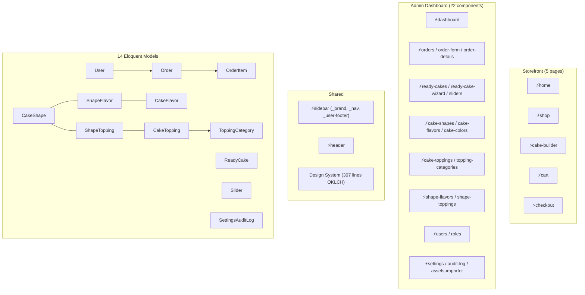

# CakeCraft Dashboard — Comprehensive Code Review

## Overall Rating: **8.5 / 10** ⭐

A polished, well-architected admin dashboard for a custom cake-ordering platform. The codebase demonstrates strong Laravel + Livewire conventions, consistent patterns, security-conscious design, and a premium visual identity.

---

## Tech Stack

| Layer | Technology |
|---|---|
| Framework | Laravel 12.51.0, PHP 8.4.11 |
| Frontend | Livewire 4.1.4, TailwindCSS 4.0 |
| Database | SQLite |
| Auth/RBAC | Spatie Permission (roles + permissions) |
| Media | Spatie MediaLibrary |
| Settings | Spatie Laravel Settings (9 groups) |
| Testing | PestPHP |

---

## Architecture Overview

---

## Scores by Category

### 🏗️ Architecture & Structure — **9/10**

| Strength | Detail |
|---|---|
| Livewire single-file components | Each `⚡component/` directory has a `.php` + `.blade.php` pair — clean co-location |
| Consistent CRUD pattern | All 15+ resource components follow: `openCreate()` → `openEdit()` → `save()` → `confirmDelete()` → `delete()` → `resetForm()` |
| Pivot models with media | `ShapeFlavor` and `ShapeTopping` are full models (not just pivot tables), enabling media attachments on many-to-many relationships |
| Settings architecture | 9 strongly-typed Spatie Settings classes with sensible defaults |
| Sidebar navigation | Logically grouped (Main → Catalog → Components → Toppings → Combinations → Users & Roles → System) with `@can` directives |

> [!NOTE]
> The single-file Livewire component approach used here is the recommended pattern for Livewire 4, keeping related logic and views tightly coupled.

### 🔒 Security & Authorization — **9/10**

| Feature | Implementation |
|---|---|
| Route protection | All admin routes wrapped in `auth` middleware |
| Component-level auth | Every `mount()` calls `$this->authorize('view ...')` |
| Action-level auth | Every CRUD method re-checks `$this->authorize()` |
| Admin role protection | Admin role can't be edited, deleted, or assigned by non-admins |
| Self-protection | Users can't block or delete themselves |
| Input validation | Comprehensive rules on all components |
| Audit logging | All settings changes tracked with old/new values + IP address |

> [!TIP]
> The double-check pattern (authorization on mount AND on each action) is excellent defense-in-depth.

### 🎨 Design System & UI — **9/10**

| Feature | Detail |
|---|---|
| OKLCH color palette | Modern, perceptually uniform color space; 15+ brand tokens |
| Custom fonts | DM Sans (body), Comfortaa (display), Caveat (handwritten) |
| 10 animations | `fade-in`, `slide-up/down`, `scale-in`, `float`, `shimmer`, `bounce-gentle`, `slide-in-left/right`, `wiggle` |
| 11 utility classes | `card-base`, `card-hover`, `stat-card`, `admin-glass`, `admin-link`, `btn-base`, `input-base`, `table-header`, `cake-card`, `frosted-glass`, `shimmer-bg` |
| Semantic tokens | `surface`, `foreground`, `accent`, `danger`, `success`, `warning`, `info` — all with background variants |
| Sidebar theme | Dedicated `sidebar-*` color tokens for a cohesive dark sidebar |

### 📋 Business Logic — **8/10**

| Feature | Quality |
|---|---|
| Order system | Supports ready-made and custom cakes, multiple items per order |
| Price calculation | `OrderItem::calculateFinalPrice()` handles both ready cake prices and custom cake pricing (base + flavor + topping) |
| Ready Cake Wizard | 6-step wizard with step validation, shape-flavor and shape-topping combination validation |
| Assets Importer | Intelligent bulk import from filesystem with real-time streaming output, auto-creates shapes, flavors, toppings, and their pivot combinations |
| Settings | 9 categories: General, Currency, Fulfillment, Payment (Stripe + PayPal + Cash), Order, Ready Cake, Branding, Appearance, System |

### 📦 Data Model — **8/10**

| Relationship | Type |
|---|---|
| `CakeShape ↔ CakeFlavor` | Many-to-Many via `ShapeFlavor` (with extra price + media) |
| `CakeShape ↔ CakeTopping` | Many-to-Many via `ShapeTopping` (with price + image_layer) |
| `ReadyCake → Shape/Flavor/Color` | BelongsTo |
| `ReadyCake ↔ Topping` | Many-to-Many |
| `Order → OrderItem` | HasMany |
| `OrderItem → ReadyCake/Shape/Flavor/Color/Topping` | BelongsTo |
| `Slider → ReadyCake` | BelongsTo |
| `CakeTopping → ToppingCategory` | BelongsTo |

---

## Improvement Opportunities

### Minor Issues (Won't impact production)

| # | Issue | Location | Impact |
|---|---|---|---|
| 1 | Flash message after `save()` always uses `$this->editingId` which is already set for edits — works but slightly misleading in the flow | Multiple components | Cosmetic |
| 2 | `filter_status !== ''` comparison could miss edge cases with boolean strings | [ready-cakes.php](file:///media/alaa/my_data/cc/resources/views/admin/⚡ready-cakes/ready-cakes.php#L87) | Minor |
| 3 | Pagination limit is fetched via `settings()` helper inline inside queries; could be cached once in `mount()` | Multiple components | Minor perf |

### Moderate Recommendations

| # | Recommendation | Rationale |
|---|---|---|
| 1 | **Add Form Request classes** or extract validation into reusable traits for the larger components (`order-form`, `settings`) | The `order-form` at 297 lines would benefit from extracting validation rules |
| 2 | **Add database transactions** to the `settings.save()` method (it saves 9+ settings groups sequentially) | If one fails mid-way, partial states are saved |
| 3 | **Add loading states / wire:loading** indicators to long operations like the Assets Importer | The streaming already helps, but visual loading spinners would improve UX |
| 4 | **Consider soft deletes** for orders and users | Prevents accidental data loss in production |
| 5 | **Add API resources / tests** | No Pest tests appear to be written yet — adding feature tests for critical flows (order creation, settings save, user CRUD) would harden the app |

### Architecture Suggestions

| # | Suggestion | Detail |
|---|---|---|
| 1 | **Extract a `HasCrudModal` trait** | 15+ components share the exact same `$showModal`, `$showDeleteModal`, `$editingId`, `$deletingId`, `resetForm()` pattern |
| 2 | **Use Livewire Form Objects** | Livewire 4's `Form` class would clean up the ~20 public properties in `settings.php` and `order-form.php` |
| 3 | **Consider an Action pattern** for complex operations | The `assets-importer` `import()` method (100+ lines) could be an `ImportAssetsAction` class |

---

## Summary

The CakeCraft dashboard is a **production-quality admin panel** with excellent attention to design, security, and code consistency. The Livewire component pattern is used correctly and idiomatically throughout, the authorization system is thorough, and the design system is modern and cohesive. The main areas for growth are test coverage, transaction safety for multi-step saves, and extracting shared patterns into reusable abstractions.

| Category | Score |
|---|---|
| Architecture & Structure | 9/10 |
| Security & Authorization | 9/10 |
| Design System & UI | 9/10 |
| Business Logic | 8/10 |
| Data Model | 8/10 |
| Test Coverage | 5/10 |
| Code DRY-ness | 7/10 |
| **Overall** | **8.5/10** |
